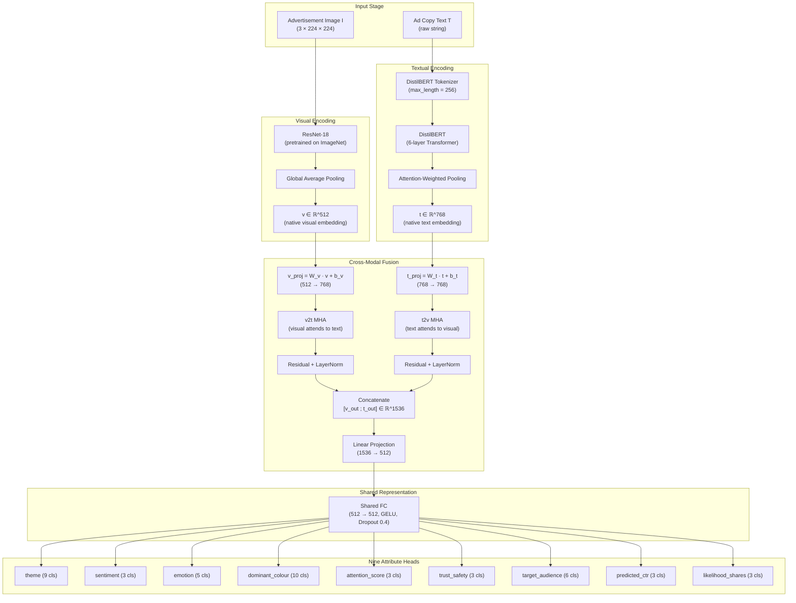
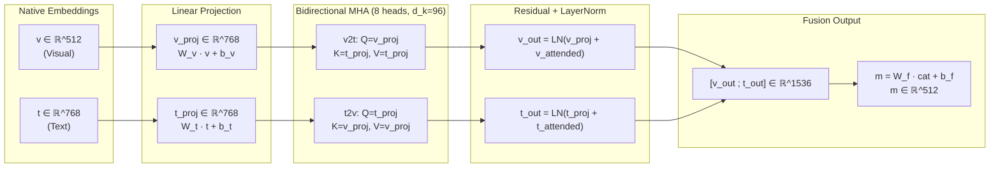
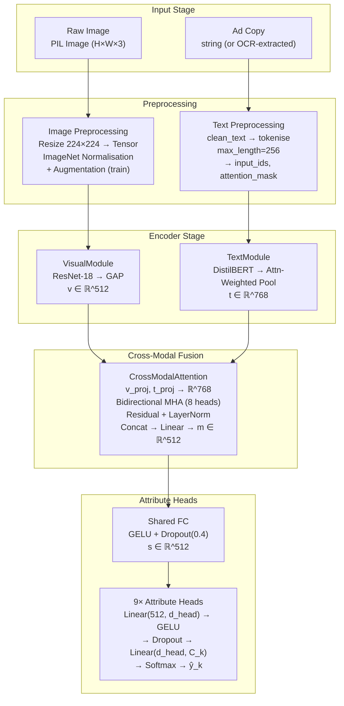
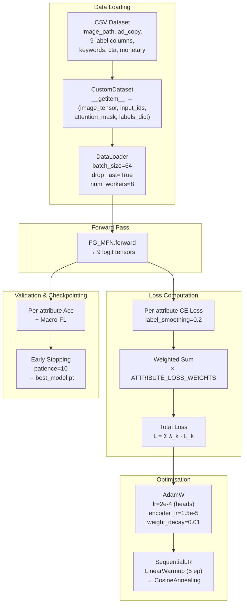
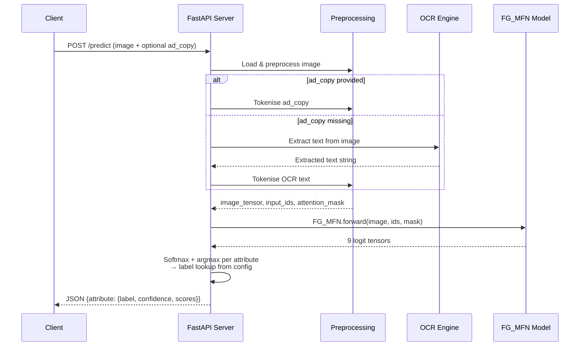

# Fine-Grained Multi-Modal Fusion Network (FG_MFN) for Advertisement Analysis

---

## CHAPTER 1: INTRODUCTION

### 1.1 Background

Modern digital advertising is a fundamentally multi-modal problem. An advertisement is rarely just an image or just a sentence — it is a deliberate composition of a visual frame, on-image text, brand cues, and a call-to-action that together aim to provoke a measurable response from the viewer. To understand an ad the way a marketing analyst would, a model must reason over both modalities simultaneously: the colour palette and composition of the image, the keywords and offers in the copy, and the way the two reinforce each other.

Unimodal approaches — sentiment-only models, image-only classifiers, or keyword-only taggers — capture only a slice of this signal. A sentiment classifier that ignores the image cannot tell the difference between a "Buy now" overlay on a luxury car and the same overlay on a discount flyer. An image classifier that ignores the copy cannot distinguish a food ad from a tech ad when both use the same warm colour palette. The most informative attributes of an ad (theme, emotion, trust & safety, target audience, predicted engagement) are *joint* properties of the visual and textual channels.

This project implements a **Fine-Grained Multi-Modal Fusion Network (FG_MFN)** — a single PyTorch model that ingests an advertisement image and its accompanying ad copy, fuses the two modalities through bidirectional cross-modal attention, and emits nine parallel predictions covering the semantic, affective, visual, and engagement dimensions of the ad.

### 1.2 Motivation

The motivation for FG_MFN is threefold:

1. **Joint reasoning.** Theme, emotion, trust & safety, and target audience are not properties of the image alone or the text alone — they emerge from the interaction. A model that fuses the modalities *late* (after each has been classified independently) loses this interaction signal.
2. **Fine-grained outputs.** A binary "positive / negative" sentiment label is too coarse for ad analysis. FG_MFN predicts nine attributes in parallel: theme (9 classes), sentiment (3), emotion (5), dominant colour (10), attention score (3), trust & safety (3), target audience (6), predicted CTR (3), and likelihood of shares (3).
3. **Practical deployment.** The model is designed to be served behind a FastAPI endpoint, taking an image and ad copy as input and returning all nine predictions in a single forward pass.

### 1.3 Problem Statement

Given an advertisement image `I` and its accompanying ad copy `T`, predict nine categorical attributes that characterise the ad:

| Attribute | Type | # Classes | Example labels |
|---|---|---|---|
| `theme` | semantic | 9 | Automotive, Education, Fashion, Finance, Food, Gaming, Home, Tech, Travel |
| `sentiment` | affective | 3 | Negative, Neutral, Positive |
| `emotion` | affective | 5 | Anger, Excitement, Fear, Joy, Trust |
| `dominant_colour` | visual | 10 | Red, Black, Blue, Green, White, Grey, Yellow, Brown, Orange, Purple |
| `attention_score` | engagement | 3 | High, Low, Medium |
| `trust_safety` | safety | 3 | Questionable, Safe, Unsafe |
| `target_audience` | demographic | 6 | 18-24, 25-34, 35-44, 45-54, 55-64, 65+ |
| `predicted_ctr` | engagement | 3 | High, Low, Medium |
| `likelihood_shares` | engagement | 3 | High, Low, Medium |

Formally, the model learns a mapping

```
f_θ : (I, T) → (ŷ_theme, ŷ_sentiment, ŷ_emotion, …, ŷ_likelihood_shares)
```

where each `ŷ_*` is a probability distribution over the corresponding label set.

### 1.4 Objectives

The objectives of this work are:

1. **Design a multi-modal architecture** that preserves the native representational power of each encoder (ResNet-18 for vision, DistilBERT for text) and only fuses them at a deliberate cross-modal attention stage.
2. **Implement nine parallel classification heads** with per-attribute loss weighting so that semantically learnable attributes (sentiment, emotion, trust_safety) dominate the gradient signal while engagement metrics (CTR, shares, attention_score) — which have near-zero correlation with image+text content — are down-weighted.
3. **Provide a complete training and inference pipeline** including OCR-based text extraction (EasyOCR / PaddleOCR), image preprocessing with augmentation, multi-task training with warmup + cosine LR schedule, and a FastAPI prediction server.
4. **Evaluate the model** on a held-out validation split and report per-attribute accuracy and macro-F1.

### 1.5 Scope

This report covers the model architecture, training pipeline, OCR integration, and inference server. It does **not** cover the web frontend, dataset collection, or deployment infrastructure.

### 1.6 Report Organisation

- **Chapter 2** — Background and Related Work (preserved as in the original report).
- **Chapter 3** — Proposed Methodology: the FG_MFN architecture, encoders, fusion, and heads.
- **Chapter 4** — Implementation: training pipeline, OCR, evaluation, and serving.
- **Chapter 5** — Conclusion and Future Work.

---


## CHAPTER 3: PROPOSED METHODOLOGY

### 3.1 System Architecture Overview

The Fine-Grained Multi-Modal Fusion Network (FG_MFN) is a unified PyTorch model designed to ingest an advertisement image and its accompanying ad copy, encode each modality through a dedicated pretrained encoder, fuse the two modalities via bidirectional cross-modal attention, and emit nine parallel attribute predictions that collectively characterise the advertisement across semantic, affective, visual, and engagement dimensions. The architecture follows a principled design philosophy: each encoder operates at its native representational dimension to preserve the full fidelity of the pretrained features, and fusion is deferred to a deliberate cross-modal attention stage where the two modalities can interact meaningfully before any dimensionality reduction occurs.

The system is composed of five sequential stages: (1) input acquisition and preprocessing, (2) visual encoding via ResNet-18, (3) textual encoding via DistilBERT with attention-weighted pooling, (4) bidirectional cross-modal attention fusion, and (5) multi-task classification through nine parallel attribute heads. Each stage is described in detail in the subsections that follow.

The overall architecture is illustrated in Figure 3.1, which depicts the end-to-end data flow from raw advertisement input to the nine attribute predictions.



**Figure 3.1:** End-to-end architecture of the FG_MFN system. The visual pathway (left) processes the advertisement image through ResNet-18 to produce a 512-dimensional embedding. The textual pathway (right) processes the ad copy through DistilBERT with attention-weighted pooling to produce a 768-dimensional embedding. Both embeddings are projected into a shared 768-dimensional attention space, where bidirectional multi-head attention enables each modality to attend to the other. The attended representations are concatenated, projected to 512 dimensions, passed through a shared fully-connected layer, and finally branched into nine parallel attribute classification heads.

The mathematical formulation of the overall system is expressed as:

$$f_\theta : (I, T) \rightarrow (\hat{y}_{\text{theme}}, \hat{y}_{\text{sentiment}}, \hat{y}_{\text{emotion}}, \hat{y}_{\text{colour}}, \hat{y}_{\text{attention}}, \hat{y}_{\text{trust}}, \hat{y}_{\text{audience}}, \hat{y}_{\text{ctr}}, \hat{y}_{\text{shares}})$$

where $I$ is the input image, $T$ is the ad copy text, and each $\hat{y}_k$ is a probability distribution over the corresponding label set produced by the $k$-th attribute head. The parameter set $\theta$ encompasses all learnable weights across the visual encoder, text encoder, cross-modal attention module, shared fully-connected layer, and the nine attribute heads.

### 3.2 Dataset

The model is trained on a curated advertisement dataset stored in CSV format, where each row represents a single advertisement sample comprising an image–text pair annotated with nine categorical labels. The dataset is designed to capture the multi-faceted nature of advertisement analysis, spanning semantic categorisation, affective understanding, visual property detection, and engagement prediction.

#### 3.2.1 Dataset Structure

Each sample in the dataset is represented as a row in a CSV file with the following columns:

| Column | Type | Description |
|---|---|---|
| `image_path` | string | Relative file path to the advertisement image (JPEG/PNG) |
| `theme` | categorical (9) | Product/service category: Automotive, Education, Fashion, Finance, Food, Gaming, Home, Tech, Travel |
| `sentiment` | categorical (3) | Overall sentiment: Negative, Neutral, Positive |
| `emotion` | categorical (5) | Primary emotion: Anger, Excitement, Fear, Joy, Trust |
| `dominant_colour` | categorical (10) | Dominant colour: Red, Black, Blue, Green, White, Grey, Yellow, Brown, Orange, Purple |
| `attention_score` | categorical (3) | Visual attention level: High, Low, Medium |
| `trust_safety` | categorical (3) | Trust/safety rating: Questionable, Safe, Unsafe |
| `target_audience` | categorical (6) | Age demographic: 18–24, 25–34, 35–44, 45–54, 55–64, 65+ |
| `predicted_ctr` | categorical (3) | Click-through rate prediction: High, Low, Medium |
| `likelihood_shares` | categorical (3) | Share likelihood: High, Low, Medium |
| `ad_copy` | text | Raw advertisement text / tagline / call-to-action |
| `keywords` | text | Extracted keywords from ad copy (comma-separated) |
| `cta` | text | Detected call-to-action phrases |
| `monetary` | text | Detected monetary mentions (prices, discounts) |
| `object_detected` | text | Detected objects in the image |

The `CustomDataset` class (`lib/preprocessing/dataset.py`) loads this CSV, encodes each categorical label into an integer class index using a label encoder, and returns a tuple `(image_tensor, label_dict, input_ids, attention_mask)` for each sample. The `label_dict` maps each of the nine attribute names to its encoded integer class index.

#### 3.2.2 Data Splits and Class Imbalance

The dataset is split into training, validation, and test subsets. Class imbalance — which is prevalent in advertisement datasets where certain themes and emotions dominate — is handled per-attribute through inverse-frequency class weights. For each attribute $k$, the class weight for class $c$ is computed as:

$$w_{k,c} = \frac{N_k}{C_k \cdot n_{k,c}}$$

where $N_k$ is the total number of training samples for attribute $k$, $C_k$ is the number of classes for attribute $k$, and $n_{k,c}$ is the number of training samples belonging to class $c$ of attribute $k$. These weights are either auto-computed from the training CSV or supplied as fixed weights in the configuration file under `ATTRIBUTE_LOSS_WEIGHTS`.

### 3.3 System Components

#### 3.3.1 Advertisement Input

Each training or inference sample is a structured tuple $(I, T, \mathbf{y})$ where:

- $I$ is a PIL image loaded from disk and converted to RGB format. The raw image may have arbitrary resolution and aspect ratio; it is standardised to $3 \times 224 \times 224$ during preprocessing (see §3.4).
- $T$ is a raw UTF-8 string representing the advertisement copy — the tagline, promotional text, or call-to-action associated with the advertisement.
- $\mathbf{y} = \{y_{\text{theme}}, y_{\text{sentiment}}, \ldots, y_{\text{shares}}\}$ is a dictionary mapping each of the nine attribute names to its integer class index.

For inference, the ad copy $T$ may either be supplied directly by the user or extracted from the image via OCR when no text is provided (see §3.3.7). This dual-mode input ensures the system can handle both structured metadata and raw advertisement images where text is embedded within the visual content.

#### 3.3.2 Visual Embedding (VisualModule)

The visual encoder is a `VisualModule` that wraps a ResNet-18 backbone pretrained on ImageNet. ResNet-18 is a 18-layer residual network that introduces skip connections to enable effective gradient flow through deep architectures. The choice of ResNet-18 over deeper variants (ResNet-50, ResNet-101) is deliberate: it provides a favourable trade-off between representational capacity and computational efficiency, producing a 512-dimensional feature vector that is sufficiently expressive for advertisement visual analysis while remaining lightweight enough for single-GPU training and real-time inference.

The visual embedding process is formulated as:

$$\mathbf{v} = f_{\theta_v}(I)$$

where $f_{\theta_v}$ denotes the ResNet-18 encoder with parameters $\theta_v$, and $\mathbf{v} \in \mathbb{R}^{512}$ is the resulting visual feature vector. The final classification layer of ResNet-18 is removed, and the output of the final convolutional block is subjected to global average pooling (GAP) to produce a fixed-length vector:

$$\mathbf{v} = \text{GAP}(\text{ResNet18}_{\text{conv}}(I)) = \frac{1}{H' \times W'} \sum_{i=1}^{H'} \sum_{j=1}^{W'} \mathbf{F}_{i,j}$$

where $\mathbf{F} \in \mathbb{R}^{512 \times H' \times W'}$ is the final convolutional feature map, and $H'$, $W'$ are its spatial dimensions. The GAP operation collapses the spatial dimensions while preserving the channel-wise feature information, yielding $\mathbf{v} \in \mathbb{R}^{512}$.

**How values are obtained:**

- The input image $I$ is resized to $224 \times 224$ and normalised with ImageNet statistics.
- It is passed through the four residual stages of ResNet-18, each comprising residual blocks with skip connections: $\mathbf{x}_{l+1} = \mathcal{F}(\mathbf{x}_l) + \mathbf{x}_l$.
- The final feature map $\mathbf{F}$ has shape $512 \times 7 \times 7$ (for a $224 \times 224$ input).
- Global average pooling reduces this to $\mathbf{v} \in \mathbb{R}^{512}$.
- No projection is applied at this stage — the visual embedding retains its native dimension of 512 to preserve the full representational power of the encoder.

The backbone may optionally be frozen ($\text{FREEZE\_BACKBONE} = \text{true}$) to combat overfitting on small datasets, though in the default configuration it is fine-tuned end-to-end ($\text{FREEZE\_BACKBONE} = \text{false}$) with a discriminative learning rate of $1.5 \times 10^{-5}$.

The `VisualModule` also supports alternative backbones through a registry pattern:

| Backbone | Native dim | Parameters |
|---|---|---|
| `resnet18` | **512 (used)** | ~11.7M |
| `resnet50` | 2048 | ~25.6M |
| `efficientnet_b0` | 1280 | ~5.3M |
| `efficientnet_b3` | 1536 | ~12M |
| `efficientnet_b7` | 2560 | ~66M |
| `convnext_tiny` | 768 | ~28.6M |
| `convnext_small` | 768 | ~50.2M |
| `convnext_base` | 1024 | ~88.6M |

#### 3.3.3 Textual Embedding (TextModule)

The text encoder is a `TextModule` wrapping DistilBERT (`distilbert-base-uncased`), a distilled version of BERT that retains approximately 97% of BERT's language understanding capability while being 60% faster and 40% smaller. DistilBERT employs a 6-layer transformer architecture with 768-dimensional hidden states and 12 attention heads per layer, producing token-level embeddings $\mathbf{H} = \{h_1, h_2, \ldots, h_L\}$ where $L \leq 256$ is the token sequence length and each $h_i \in \mathbb{R}^{768}$.

The tokenisation process uses DistilBERT's own WordPiece tokenizer with a maximum sequence length of 256 tokens and dynamic padding. The encoder is loaded with `attn_implementation='eager'` to expose the self-attention weights from the final layer, which are required for the attention-weighted pooling strategy.

**Attention-Weighted Pooling.** The recommended and default pooling strategy is attention-weighted pooling, which leverages the encoder's own learned attention to produce a more informative sentence-level representation. Given the token-level embeddings $\mathbf{H} = \{h_1, h_2, \ldots, h_L\}$ and the self-attention weights $\mathbf{A} \in \mathbb{R}^{L \times L}$ from the final transformer layer, the attention-weighted pooled representation is computed as:

$$\mathbf{t} = \sum_{i=1}^{L} \alpha_i \cdot h_i$$

where the token importance weight $\alpha_i$ is derived from the encoder's own attention distribution:

$$\alpha_i = \frac{\sum_{j=1}^{L} A_{i,j}}{\sum_{k=1}^{L} \sum_{j=1}^{L} A_{k,j}}$$

Here, $A_{i,j}$ represents the attention weight from token $i$ to token $j$ in the final self-attention layer. Tokens that receive high attention from other tokens (keywords, brand names, prices, call-to-action phrases) naturally receive higher $\alpha_i$ values, while padding tokens receive near-zero weights automatically. This pooling strategy requires no additional learnable parameters — it repurposes the encoder's own learned attention to identify the most informative tokens.

**How values are obtained:**

- The raw ad copy $T$ is tokenised into subword tokens $\{t_1, t_2, \ldots, t_L\}$ with `[CLS]` and `[SEP]` tokens appended.
- The token sequence is passed through all six DistilBERT transformer layers, each applying multi-head self-attention and feed-forward transformations.
- The final layer produces token embeddings $\mathbf{H} \in \mathbb{R}^{L \times 768}$ and attention weights $\mathbf{A} \in \mathbb{R}^{12 \times L \times L}$ (12 heads).
- The attention weights are averaged across heads to obtain a single attention matrix $\bar{A} \in \mathbb{R}^{L \times L}$.
- Token importance scores $\alpha_i$ are computed by row-summing $\bar{A}$ and normalising.
- The weighted sum produces the final text embedding $\mathbf{t} \in \mathbb{R}^{768}$.

Alternative pooling strategies supported by the `TextModule` include:

- **Mean pooling** — $\mathbf{t} = \frac{1}{L_{\text{valid}}} \sum_{i=1}^{L_{\text{valid}}} h_i$, where $L_{\text{valid}}$ excludes padding tokens. Treats all content tokens equally.
- **CLS pooling** — $\mathbf{t} = h_{[\text{CLS}]}$, using only the `[CLS]` token embedding. Simpler but often less informative than attention-weighted pooling.

#### 3.3.4 Dimensional Projection (Fusion Setup)

A critical design principle of FG_MFN is that both modalities retain their native dimensions through the encoding stage. No information is discarded before the fusion stage — the visual embedding remains at $\mathbf{v} \in \mathbb{R}^{512}$ and the text embedding remains at $\mathbf{t} \in \mathbb{R}^{768}$. This ensures that the cross-modal attention module operates on the full representational power of each encoder, rather than on a lossy compressed version.

Three fusion strategies are supported, controlled by the `FUSION_TYPE` configuration parameter:

| Strategy | Mechanism | Formula |
|---|---|---|
| `concat` | Concatenation + Linear | $\mathbf{m} = W_f [\mathbf{v} ; \mathbf{t}] + b_f$ where $W_f \in \mathbb{R}^{d_h \times (512+768)}$ |
| `add` | Element-wise addition + Linear | $\mathbf{m} = W_f (\mathbf{v} + \mathbf{t}) + b_f$ (requires $512 = 768$, not applicable) |
| `attention` | Bidirectional cross-modal MHA | See §3.3.5 for detailed formulation |

The default and recommended strategy is `attention`, which enables the richest cross-modal interaction by allowing each modality to selectively attend to the other through multi-head attention.

#### 3.3.5 Cross-Modal Fusion (CrossModalAttention)

The `CrossModalAttention` module is the core innovation of the FG_MFN architecture. It implements bidirectional cross-modal attention, enabling the visual and textual modalities to interact through multi-head attention in both directions simultaneously. This design captures the complementary and synergistic relationships between advertisement images and ad copy that unidirectional or simple concatenation fusion strategies would miss.

The fusion process consists of four sequential steps:

**Step 1: Project to Shared Attention Space.** Both modalities are linearly projected into a shared attention dimension $d_a = 768$ (configured as `ATTENTION_DIM`):

$$\mathbf{v}_{\text{proj}} = W_v \mathbf{v} + b_v, \quad W_v \in \mathbb{R}^{768 \times 512}, \quad \mathbf{v}_{\text{proj}} \in \mathbb{R}^{768}$$

$$\mathbf{t}_{\text{proj}} = W_t \mathbf{t} + b_t, \quad W_t \in \mathbb{R}^{768 \times 768}, \quad \mathbf{t}_{\text{proj}} \in \mathbb{R}^{768}$$

Since the visual and text embeddings arrive at different native dimensions (512 and 768 respectively), this projection aligns them into a common representational space where cross-modal attention can be computed. The projection is learned end-to-end, allowing the model to discover the optimal mapping for each modality.

**Step 2: Bidirectional Multi-Head Attention.** Two parallel multi-head attention (MHA) operations are performed. The visual-to-text (v2t) attention allows the visual representation to attend to the text representation, answering the question "which textual features are relevant to this image?":

$$\mathbf{v}_{\text{attended}} = \text{MHA}(Q = \mathbf{v}_{\text{proj}}, K = \mathbf{t}_{\text{proj}}, V = \mathbf{t}_{\text{proj}})$$

The text-to-visual (t2v) attention allows the text representation to attend to the visual representation, answering the question "which visual features support this text?":

$$\mathbf{t}_{\text{attended}} = \text{MHA}(Q = \mathbf{t}_{\text{proj}}, K = \mathbf{v}_{\text{proj}}, V = \mathbf{v}_{\text{proj}})$$

Each MHA operation uses $h = 8$ attention heads (configured as `ATTENTION_HEADS`), with each head operating on a subspace of dimension $d_k = d_a / h = 768 / 8 = 96$. The multi-head attention for a single direction is computed as:

$$\text{MHA}(Q, K, V) = \text{Concat}(\text{head}_1, \ldots, \text{head}_h) W^O$$

where each attention head computes:

$$\text{head}_i = \text{softmax}\left(\frac{Q_i K_i^T}{\sqrt{d_k}}\right) V_i$$

and $Q_i = Q W_i^Q$, $K_i = K W_i^K$, $V_i = V W_i^V$ are the query, key, and value projections for head $i$ with $W_i^Q, W_i^K, W_i^V \in \mathbb{R}^{768 \times 96}$ and $W^O \in \mathbb{R}^{768 \times 768}$.

Since the inputs are single vectors (not sequences), the attention effectively computes a soft selection over the other modality's features, producing attended representations that incorporate cross-modal context.

**Step 3: Residual Connection and Layer Normalisation.** Following each MHA operation, a residual connection and layer normalisation are applied to stabilise training and preserve the original modality information:

$$\mathbf{v}_{\text{out}} = \text{LayerNorm}(\mathbf{v}_{\text{proj}} + \mathbf{v}_{\text{attended}})$$

$$\mathbf{t}_{\text{out}} = \text{LayerNorm}(\mathbf{t}_{\text{proj}} + \mathbf{t}_{\text{attended}})$$

The residual connection ensures that the original modality information is preserved alongside the cross-modal attended features. Layer normalisation stabilises the distribution of the combined representation, accelerating convergence and improving generalisation. A dropout of 0.4 is applied to the attention outputs before the residual addition.

**Step 4: Concatenation and Projection to Hidden Dimension.** The two attended representations are concatenated and projected to the hidden dimension $d_h = 512$ (configured as `HIDDEN_DIM`):

$$\mathbf{m} = W_f [\mathbf{v}_{\text{out}} ; \mathbf{t}_{\text{out}}] + b_f, \quad W_f \in \mathbb{R}^{512 \times 1536}, \quad \mathbf{m} \in \mathbb{R}^{512}$$

where $[\cdot ; \cdot]$ denotes concatenation along the feature dimension, producing a 1536-dimensional vector ($768 + 768$) that is linearly projected to 512 dimensions. This fused representation $\mathbf{m}$ encodes the joint visual-textual information from the advertisement, enriched by bidirectional cross-modal attention.

**How values are obtained:**

- The visual embedding $\mathbf{v} \in \mathbb{R}^{512}$ and text embedding $\mathbf{t} \in \mathbb{R}^{768}$ are each projected to $\mathbb{R}^{768}$ via learned linear layers.
- Two parallel MHA operations compute $\mathbf{v}_{\text{attended}}$ (visual attends to text) and $\mathbf{t}_{\text{attended}}$ (text attends to visual), each using 8 heads with $d_k = 96$.
- Residual connections and LayerNorm are applied to both directions independently.
- The two 768-dimensional outputs are concatenated ($1536$-d) and projected to $512$-d.

The cross-modal attention flow is illustrated in Figure 3.2.



**Figure 3.2:** Detailed flow of the CrossModalAttention module. Both modalities are projected into a shared 768-dimensional space, bidirectional MHA is applied with 8 heads, residual connections and LayerNorm stabilise the outputs, and the concatenated result is projected to the 512-dimensional hidden representation.

#### 3.3.6 Attribute Learning Heads

After the cross-modal fusion stage, the 512-dimensional fused representation $\mathbf{m}$ passes through a shared fully-connected layer and then branches into nine parallel attribute classification heads. This multi-task architecture enables the model to learn shared representations that benefit all attributes while allowing each attribute to specialise through its own private classification head.

**Shared Fully-Connected Layer.** When `DEEP_SHARED_LAYER = true` (the default), the shared FC applies a two-layer transformation with non-linearity and regularisation:

$$\mathbf{s} = \text{GELU}(\text{Dropout}(\mathbf{m}))$$

where $\mathbf{s} \in \mathbb{R}^{512}$ is the shared representation. The GELU (Gaussian Error Linear Unit) activation is chosen for its smooth, non-monotonic properties that have been shown to outperform ReLU in transformer-based architectures:

$$\text{GELU}(x) = x \cdot \Phi(x) = x \cdot \frac{1}{2}\left[1 + \text{erf}\left(\frac{x}{\sqrt{2}}\right)\right]$$

where $\Phi(x)$ is the cumulative distribution function of the standard normal distribution. A dropout rate of 0.4 is applied to prevent co-adaptation of features.

**Per-Attribute Classification Heads.** Each of the nine attributes has a dedicated two-layer MLP that maps the shared representation to attribute-specific logits:

$$\hat{y}_k = W_k^{(2)} \cdot \text{GELU}\left(\text{Dropout}\left(W_k^{(1)} \mathbf{s} + b_k^{(1)}\right)\right) + b_k^{(2)}$$

where $W_k^{(1)} \in \mathbb{R}^{d_{\text{head}} \times 512}$, $W_k^{(2)} \in \mathbb{R}^{C_k \times d_{\text{head}}}$, and $C_k$ is the number of classes for attribute $k$. The intermediate dimension $d_{\text{head}}$ is computed as:

$$d_{\text{head}} = \max\left(\frac{d_h}{2}, \; 4 \cdot C_k\right)$$

This adaptive sizing ensures that attributes with more classes (e.g., `dominant_colour` with 10 classes, `theme` with 9 classes) receive larger intermediate representations, while simpler attributes (e.g., `sentiment` with 3 classes) use more compact heads. The softmax activation is applied to the logits to produce a probability distribution:

$$P(y_k = c \mid \mathbf{s}) = \frac{\exp(\hat{y}_{k,c})}{\sum_{j=1}^{C_k} \exp(\hat{y}_{k,j})}$$

The nine attribute heads and their configurations are summarised in the table below:

| Attribute | $C_k$ (Classes) | $d_{\text{head}}$ | Loss Weight $\lambda_k$ |
|---|---|---|---|
| `theme` | 9 | 256 | 1.0 |
| `sentiment` | 3 | 256 | 1.5 |
| `emotion` | 5 | 256 | 1.5 |
| `dominant_colour` | 10 | 256 | 1.0 |
| `attention_score` | 3 | 256 | 0.1 |
| `trust_safety` | 3 | 256 | 1.5 |
| `target_audience` | 6 | 256 | 1.2 |
| `predicted_ctr` | 3 | 256 | 0.1 |
| `likelihood_shares` | 3 | 256 | 0.1 |

**Joint Loss Function.** The system is trained by optimising all nine tasks simultaneously using a weighted loss function:

$$\mathcal{L}_{\text{total}} = \sum_{k=1}^{9} \lambda_k \cdot \mathcal{L}_k$$

where each $\mathcal{L}_k$ is the label-smoothed cross-entropy loss for attribute $k$:

$$\mathcal{L}_k = -\sum_{c=1}^{C_k} q_{k,c} \log P(y_k = c \mid \mathbf{s})$$

and $q_{k,c}$ is the label-smoothed target distribution:

$$q_{k,c} = \begin{cases} 1 - \epsilon + \frac{\epsilon}{C_k} & \text{if } c = y_k^* \\ \frac{\epsilon}{C_k} & \text{otherwise} \end{cases}$$

with label smoothing factor $\epsilon = 0.2$. Label smoothing prevents the model from becoming overconfident and improves generalisation by discouraging exact zero gradients for incorrect classes.

The per-attribute loss weights $\lambda_k$ serve a critical role in balancing the gradient contributions across attributes. Engagement metrics (`attention_score`, `predicted_ctr`, `likelihood_shares`) are down-weighted to $\lambda_k = 0.1$ because they exhibit near-zero correlation with image+text content (Cramér's V $\approx 0.02$–$0.04$), meaning their gradients are largely noise. By down-weighting these attributes, the semantic heads (`theme`, `sentiment`, `emotion`, `trust_safety`, `target_audience`) dominate the gradient signal, leading to more meaningful feature learning.

**How values are obtained:**

- The fused representation $\mathbf{m} \in \mathbb{R}^{512}$ is passed through the shared FC with GELU activation and 0.4 dropout.
- Each attribute head applies its own two-layer MLP: $\text{Linear}(512, d_{\text{head}}) \rightarrow \text{GELU} \rightarrow \text{Dropout} \rightarrow \text{Linear}(d_{\text{head}}, C_k)$.
- Softmax is applied to each head's logits to produce probability distributions.
- The weighted sum of per-attribute label-smoothed cross-entropy losses forms the total loss.

#### 3.3.7 OCR Pipeline

When ad copy is not supplied directly by the user, it is extracted from the advertisement image via Optical Character Recognition (OCR). This is essential for real-world advertisement analysis, where the promotional text is often embedded within the image itself — as logos, taglines, price overlays, or call-to-action banners — rather than provided as separate metadata.

The OCR engine is selected via the `ocr.engine` configuration key, supporting two engines through a factory pattern:

- **EasyOCR** (default) — Uses CRAFT (Character Region Awareness for Text Detection) for text localisation and a CRNN-based recogniser for text decoding. Supports 80+ languages with automatic script detection. Models are downloaded on first use and cached in `local/ocr/` for subsequent runs.
- **PaddleOCR** — Baidu's OCR toolkit, known for high accuracy and speed, especially on multilingual and curved text in natural scenes. Uses a differentiable binarisation module for text detection and an attention-based recogniser.

The OCR factory (`lib/ocr/factory.py`) instantiates the selected engine based on the configuration, and the engine exposes a standardised interface:

- `extract_text(image) → str` — Takes a PIL image and returns the concatenated recognised text from all detected text regions.
- `get_status() → dict` — Returns the engine's health status and model load information.
- `clear_cache()` — Releases cached model weights to free GPU memory.

OCR is invoked lazily on first use, and the engine instance is cached for the lifetime of the process to avoid repeated model loading overhead. During inference, if the user does not supply ad copy, the OCR pipeline is automatically triggered to extract text from the image before passing it to the text encoder.

### 3.4 Image Preprocessing

Image preprocessing is a critical stage that transforms raw advertisement images of varying resolution, aspect ratio, and quality into standardised tensors suitable for the ResNet-18 encoder. The preprocessing pipeline is implemented in `lib/preprocessing/image/transforms.py` and applies a sequence of deterministic and stochastic transformations.

**Deterministic Transformations (applied to all splits):**

1. **Resize** — The image is resized to $224 \times 224$ pixels to match the input dimensions expected by ResNet-18. The resizing uses bilinear interpolation.

2. **ImageNet Normalisation** — Each pixel channel is normalised using the ImageNet dataset statistics:

$$I_c' = \frac{I_c - \mu_c}{\sigma_c}, \quad c \in \{R, G, B\}$$

where $\mu = (0.485, 0.456, 0.406)$ and $\sigma = (0.229, 0.224, 0.225)$ are the per-channel mean and standard deviation computed from the ImageNet training set. This normalisation is essential because the ResNet-18 backbone was pretrained on ImageNet-normalised data.

**Stochastic Augmentation (training split only):**

During training, additional augmentation transformations are applied to improve the model's robustness to visual variations in advertisement images:

1. **Random Horizontal Flip** ($p = 0.5$) — Mirrors the image horizontally with 50% probability. This teaches the model invariance to left-right orientation, which is common in advertisement layouts.

2. **Random Rotation** ($\pm 10°$, $p = 0.4$) — Rotates the image by a random angle $\theta \sim \text{Uniform}(-10°, 10°)$ with 40% probability. This simulates slight camera or layout misalignments.

3. **Colour Jitter** — Randomly adjusts brightness, contrast, saturation, and hue of the image:
   - Brightness factor $\sim \text{Uniform}(0.7, 1.3)$
   - Contrast factor $\sim \text{Uniform}(0.7, 1.3)$
   - Saturation factor $\sim \text{Uniform}(0.8, 1.2)$
   - Hue factor $\sim \text{Uniform}(-0.05, 0.05)$ — applied as a real HSV hue rotation, which shifts the colour spectrum while preserving perceptual colour relationships.

4. **Random Resized Crop** — Crops a random region of the image with area scale $\in [0.85, 1.0]$ and aspect ratio $\in [0.85, 1.15]$, then resizes to $224 \times 224$. This simulates variations in framing and zoom.

Validation and test images are never augmented — they receive only the deterministic resize and normalisation transformations to ensure reproducible evaluation.

### 3.5 Text Preprocessing

Text preprocessing transforms raw advertisement copy into clean, structured input for the DistilBERT encoder. The pipeline is implemented across two modules in `lib/preprocessing/text/`.

**Text Cleaning (`cleaner.py`):** The `clean_text` function performs standard normalisation:

- Lowercasing all characters to reduce vocabulary size.
- Stripping URLs (matching patterns such as `http://`, `https://`, `www.`).
- Collapsing multiple whitespace characters into single spaces.
- Removing or normalising special characters.

The `clean_adcopy` function applies additional advertisement-specific cleaning:

- Removing duplicate n-grams that commonly arise from OCR errors or repetitive marketing language.
- Normalising currency symbols (e.g., `$`, `USD`, `€`, `£`) to a canonical form.
- Stripping HTML artefacts that may be present in scraped advertisement text.

**Structured Signal Extraction (`pipeline.py`):** Beyond basic cleaning, the text preprocessing pipeline extracts structured signals that characterise the advertisement's textual content:

1. **Keyword Extraction** (`extract_keywords`) — Identifies the most informative terms in the ad copy using term frequency (TF) analysis against a curated list of advertisement-specific keywords (`COMMON_KEYWORDS`, `PRODUCT_KEYWORDS`). These keywords capture product categories, brand attributes, and marketing terminology.

2. **Monetary Mention Detection** (`extract_monetary_mention`) — Detects prices, discounts, and financial references using pattern matching for symbols (`$`, `USD`, `%`, `off`, `save`, `free`, `deal`). This identifies the commercial intent embedded in the ad copy.

3. **Call-to-Action Detection** (`extract_call_to_action`) — Identifies imperative phrases that drive user action (e.g., "Buy now", "Shop today", "Sign up", "Learn more", "Get started") by matching against a curated list of `CTA_PHRASES`. CTAs are strong signals for engagement prediction.

4. **Object Detection in Text** (`extract_objects_mentioned`) — Performs named-entity recognition (NER) to identify product names, brand names, and object references mentioned in the ad copy.

These structured signals are available as auxiliary features for future model extensions. In the current FG_MFN architecture, the text encoder receives the cleaned ad copy directly — the structured signals serve as interpretability tools and potential future inputs.

### 3.6 Training Configuration

The training configuration is designed to balance effective learning across all nine attribute tasks while preventing overfitting and ensuring stable convergence. All hyperparameters are specified in `configs/model/model_config.json` and require no code changes to modify.

| Hyperparameter | Value | Rationale |
|---|---|---|
| Optimiser | AdamW | Decoupled weight decay for better generalisation |
| Learning rate (heads, projection, shared FC) | $2 \times 10^{-4}$ | Standard for randomly initialised layers |
| Encoder learning rate (ResNet-18, DistilBERT) | $1.5 \times 10^{-5}$ | Lower rate to preserve pretrained knowledge |
| Weight decay | 0.01 | Applied to all parameters except bias and LayerNorm |
| Batch size | 64 | With `drop_last=True` to ensure consistent batch sizes |
| Maximum epochs | 100 | With early stopping to prevent overfitting |
| Early stopping patience | 10 | Monitors validation mean accuracy |
| Warmup epochs | 5 | Linear warmup from near-zero to target LR |
| LR schedule | Cosine annealing to $10^{-6}$ | Smooth decay following warmup |
| Label smoothing | $\epsilon = 0.2$ | Prevents overconfidence, improves generalisation |
| Dropout | 0.4 | Applied in shared FC and attribute heads |
| Backbone frozen | No | Full fine-tuning with discriminative LR |
| Deep shared layer | Yes | Two-layer shared FC with GELU activation |

The learning rate schedule follows a two-phase approach:

**Phase 1: Linear Warmup (Epochs 1–5).** The learning rate is linearly increased from a small initial value to the target learning rate:

$$\eta_t = \eta_{\text{target}} \cdot \frac{t}{T_{\text{warmup}}}$$

where $t$ is the current training step and $T_{\text{warmup}}$ is the total number of warmup steps. This prevents large, destabilising gradient updates at the beginning of training when the randomly initialised fusion and head layers are sensitive.

**Phase 2: Cosine Annealing (Epochs 6–100).** After warmup, the learning rate follows a cosine decay schedule:

$$\eta_t = \eta_{\min} + \frac{1}{2}(\eta_{\max} - \eta_{\min})\left(1 + \cos\left(\frac{\pi \cdot t'}{T_{\max}}\right)\right)$$

where $t'$ is the step count since warmup ended, $T_{\max}$ is the total number of remaining steps, $\eta_{\max} = 2 \times 10^{-4}$ (for heads) or $1.5 \times 10^{-5}$ (for encoders), and $\eta_{\min} = 10^{-6}$. The cosine schedule provides a smooth decay that allows the model to converge to a good solution while still exploring the loss landscape in the early phases.

### 3.7 Tools, Languages and Frameworks

The proposed multimodal advertisement analysis system relies on a carefully chosen set of programming languages, deep learning frameworks, computer vision libraries, NLP tools, data processing libraries, and visualisation tools. These tools are selected to ensure high efficiency, scalability, and interpretability while allowing the system to handle complex multimodal inputs, large-scale datasets, and downstream tasks such as sentiment analysis.

#### 3.7.1 Programming Language: Python

Python is the backbone of the entire system. Its simplicity, readability, and flexibility make it ideal for research and production environments. Python is widely used in AI and data science due to its extensive ecosystem of libraries and frameworks, allowing rapid prototyping and implementation of complex pipelines. Python handles preprocessing, embedding extraction, model training, multimodal fusion, attribute predictions, evaluation, and visualisation, serving as the glue between all modules.

#### 3.7.2 Deep Learning Framework: PyTorch

PyTorch is the primary deep learning framework for building and training neural networks in this project. It is chosen for its dynamic computational graph, which allows flexibility in handling variable-length inputs, attention mechanisms, and complex fusion strategies between modalities. PyTorch implements the visual embedding (ResNet-18), textual embedding (DistilBERT), dimensional projection, cross-modal attention fusion, and attribute learning heads. Its tensor operations allow seamless calculation of gradients, losses, and optimisation for multi-task objectives.

#### 3.7.3 Computer Vision Library: OpenCV

OpenCV is employed for handling all image-related preprocessing and augmentation tasks. Digital advertisements can vary significantly in resolution, colour, style, and layout. OpenCV ensures images are standardised and prepared for neural network input.

#### 3.7.4 NLP Framework: Hugging Face Transformers

The Hugging Face Transformers library provides the DistilBERT model and its associated tokenizer. It handles tokenisation, model loading, and attention weight extraction, and integrates seamlessly with PyTorch for end-to-end differentiable training.

#### 3.7.5 OCR Engines: EasyOCR and PaddleOCR

- **EasyOCR** — A ready-to-use OCR library supporting 80+ languages, based on CRAFT for text detection and a CRNN-based recogniser.
- **PaddleOCR** — Baidu's OCR toolkit, known for high accuracy and speed, especially on multilingual text.

#### 3.7.6 Serving Framework: FastAPI

FastAPI is a modern Python web framework for building APIs. It provides automatic OpenAPI documentation, async support for high-throughput endpoints, and easy integration with PyTorch models for serving predictions.

#### 3.7.7 Evaluation: scikit-learn

scikit-learn provides the metrics for model evaluation: per-attribute accuracy, macro-averaged F1 score, and confusion matrices. These metrics are computed on the held-out validation split after each training epoch.

---

## CHAPTER 4: IMPLEMENTATION

This chapter details the end-to-end implementation of the FG_MFN system, covering the complete data flow from raw advertisement input to multi-attribute prediction, the training pipeline with all its sub-stages, the inference and serving architecture, the evaluation framework, and the configuration system. Each subsection provides the mathematical formulation, the concrete code mapping, and an explanation of how values are obtained at every stage.

### 4.1 System Interaction & Data Flow

The FG_MFN system processes an advertisement through a sequence of well-defined stages, each producing a tensor with a precisely specified shape and semantics. The overall data flow is illustrated in Figure 4.1.



**Figure 4.1:** End-to-end data flow of the FG_MFN system. Raw image and text inputs pass through preprocessing, encoding, cross-modal fusion, and nine parallel attribute heads. Each arrow represents a tensor transformation with a precisely defined shape.

The formal data flow can be expressed as a composition of functions:

$$f_{\text{system}}(I, T) = \left(\text{Head}_k\left(\text{SharedFC}\left(\text{CrossModalAttn}\left(f_{\theta_v}(I),\; f_{\theta_t}(T)\right)\right)\right)\right)_{k=1}^{9}$$

where $I$ is the raw image, $T$ is the ad copy string, $f_{\theta_v}$ is the visual encoder, $f_{\theta_t}$ is the text encoder, and $\text{Head}_k$ is the $k$-th attribute classification head.

#### 4.1.1 Advertisement Input

**Raw Input.** The system accepts two inputs for each advertisement:

1. **Image** — A PIL Image object of arbitrary resolution and aspect ratio, loaded from the file path specified in the `image_path` column of the CSV dataset. The image may be in JPEG, PNG, or WebP format.

2. **Ad Copy** — A text string containing the promotional text of the advertisement. This is sourced from the `ad_copy` column of the CSV. If this field is empty or missing, the OCR pipeline is automatically invoked to extract text from the image.

**How values are obtained:**

- The `CustomDataset` class (`lib/preprocessing/dataset.py`) reads the CSV file using pandas, where each row represents one advertisement sample.
- For each row, `image_path` is resolved relative to the dataset root directory, and the image is loaded using PIL's `Image.open()` with conversion to RGB.
- The `ad_copy` field is read as a string. If it is `NaN` or empty, the OCR engine is called at inference time to extract text from the image.
- Additional structured fields — `keywords`, `cta` (call-to-action), `monetary`, `object_detected` — are read from the CSV and stored as auxiliary metadata, available for future model extensions.

#### 4.1.2 Image Preprocessing

Image preprocessing transforms the raw PIL image of arbitrary size into a standardised tensor suitable for the ResNet-18 encoder. The pipeline is implemented in `lib/preprocessing/image/transforms.py` and consists of deterministic and stochastic stages.

**Deterministic Transformations (all splits):**

1. **Resize to $224 \times 224$:** The image is resized using bilinear interpolation to match the input dimensions expected by the ResNet-18 backbone. The resizing operation is:

$$I_{\text{resized}} = \text{Resize}(I_{\text{raw}}, (224, 224))$$

2. **Conversion to Tensor:** The PIL image (range $[0, 255]$) is converted to a PyTorch float tensor (range $[0, 1]$):

$$I_{\text{tensor},c} = \frac{I_{\text{PIL},c}}{255.0}, \quad c \in \{R, G, B\}$$

3. **ImageNet Normalisation:** Each channel is normalised using the ImageNet dataset statistics:

$$I'_{c} = \frac{I_{\text{tensor},c} - \mu_c}{\sigma_c}$$

where $\mu = (0.485, 0.456, 0.406)$ and $\sigma = (0.229, 0.224, 0.225)$. This normalisation is essential because the ResNet-18 backbone was pretrained on ImageNet-normalised data; failing to apply it would cause a distribution mismatch that degrades feature quality.

**Stochastic Augmentation (training split only):**

During training, additional augmentation transformations are applied before normalisation to improve robustness:

1. **Random Horizontal Flip** ($p = 0.5$):

$$I_{\text{flip}} = \begin{cases} \text{FlipLR}(I_{\text{resized}}) & \text{with probability } 0.5 \\ I_{\text{resized}} & \text{otherwise} \end{cases}$$

2. **Random Rotation** ($\theta \sim \text{Uniform}(-10°, 10°)$, $p = 0.4$):

$$I_{\text{rot}} = \text{Rotate}(I_{\text{flip}}, \theta), \quad \theta \sim U(-10°, 10°) \text{ with } p = 0.4$$

3. **Colour Jitter** — Adjusts brightness, contrast, saturation, and hue:

$$I_{\text{jitter}} = \text{ColorJitter}(I_{\text{rot}}, b, c, s, h)$$

where $b \sim U(0.7, 1.3)$, $c \sim U(0.7, 1.3)$, $s \sim U(0.8, 1.2)$, $h \sim U(-0.05, 0.05)$. The hue rotation is applied in HSV colour space, shifting the colour spectrum while preserving perceptual colour relationships.

4. **Random Resized Crop** — Crops a random region with area scale $\in [0.85, 1.0]$ and aspect ratio $\in [0.85, 1.15]$, then resizes to $224 \times 224$.

**How values are obtained:**

- The `get_transforms()` function returns a `torchvision.transforms.Compose` pipeline based on the split argument (`"train"`, `"val"`, or `"test"`).
- For training, the full augmentation chain is applied; for validation and test, only resize, tensor conversion, and normalisation are applied.
- The output tensor has shape $(3, 224, 224)$ with dtype `float32`, ready for direct input to the ResNet-18 backbone.

#### 4.1.3 Text Preprocessing

Text preprocessing transforms the raw ad copy string into tokenised input for the DistilBERT encoder. The pipeline is implemented across `lib/preprocessing/text/cleaner.py` and `lib/preprocessing/text/pipeline.py`.

**Stage 1: Text Cleaning.** The `clean_text` function performs standard normalisation:

$$T_{\text{clean}} = \text{Lowercase}(\text{CollapseWhitespace}(\text{StripURLs}(T_{\text{raw}})))$$

The `clean_adcopy` function applies additional advertisement-specific cleaning:

- Removing duplicate n-grams from OCR errors or repetitive marketing language.
- Normalising currency symbols (`$`, `USD`, `€`, `£`) to a canonical form.
- Stripping HTML artefacts from scraped advertisement text.

**Stage 2: Tokenisation.** The cleaned text is tokenised using the DistilBERT tokenizer (`distilbert-base-uncased`):

$$T_{\text{tokens}} = \text{Tokenizer}(T_{\text{clean}}, \text{max\_length}=256, \text{padding}=\text{'max\_length'}, \text{truncation}=\text{True})$$

This produces three tensors:

- `input_ids` $\in \mathbb{Z}^{256}$ — Integer token IDs, with padding token ID = 0.
- `attention_mask` $\in \{0, 1\}^{256}$ — Binary mask where 1 indicates real tokens and 0 indicates padding.

**Stage 3: Structured Signal Extraction.** Beyond basic cleaning, the pipeline extracts structured signals:

1. **Keyword Extraction** — Identifies informative terms using TF analysis against curated advertisement keyword lists (`COMMON_KEYWORDS`, `PRODUCT_KEYWORDS`).

2. **Monetary Mention Detection** — Detects prices and financial references using pattern matching for symbols (`$`, `USD`, `%`, `off`, `save`, `free`, `deal`).

3. **Call-to-Action Detection** — Identifies imperative phrases (e.g., "Buy now", "Shop today", "Sign up") by matching against a curated `CTA_PHRASES` list.

4. **Object Detection in Text** — Performs named-entity recognition to identify product names, brand names, and object references.

These structured signals are stored as auxiliary features in the dataset and are available for future model extensions.

**How values are obtained:**

- The `CustomDataset.__getitem__` method calls the text cleaner and then the tokenizer.
- The tokenizer returns a dictionary with `input_ids` and `attention_mask`, both as PyTorch tensors of shape $(256,)$.
- The `attention_mask` is critical for the attention-weighted pooling in the TextModule: it ensures that padding tokens do not contribute to the pooled representation.

#### 4.1.4 Visual Embedding (ResNet-18)

The preprocessed image tensor $\mathbf{I} \in \mathbb{R}^{3 \times 224 \times 224}$ is passed through the `VisualModule`, which wraps a ResNet-18 backbone pretrained on ImageNet. The visual encoding process is:

$$\mathbf{v} = f_{\theta_v}(\mathbf{I}) = \text{GAP}(\text{ResNet18}_{\theta_v}(\mathbf{I}))$$

where GAP denotes Global Average Pooling and $\mathbf{v} \in \mathbb{R}^{512}$ is the visual embedding.

**ResNet-18 Architecture Detail.** ResNet-18 consists of an initial convolutional stem followed by four residual stages:

| Stage | Layers | Output Spatial Size | Channels |
|---|---|---|---|
| Conv1 + BN + ReLU + MaxPool | 1 | $56 \times 56$ | 64 |
| Layer1 (BasicBlock ×2) | 2 | $56 \times 56$ | 64 |
| Layer2 (BasicBlock ×2) | 2 | $28 \times 28$ | 128 |
| Layer3 (BasicBlock ×2) | 2 | $14 \times 14$ | 256 |
| Layer4 (BasicBlock ×2) | 2 | $7 \times 7$ | 512 |

Each BasicBlock contains two $3 \times 3$ convolutions with batch normalisation and ReLU, plus a residual (skip) connection:

$$\mathbf{x}_{\text{out}} = \mathcal{F}(\mathbf{x}, \{W_i\}) + \mathbf{x}$$

where $\mathcal{F}$ represents the residual mapping (two conv-BN-ReLU layers) and $\mathbf{x}$ is the identity shortcut. The final feature map has shape $(B, 512, 7, 7)$, which is reduced to $(B, 512)$ via global average pooling:

$$\mathbf{v}_j = \frac{1}{49} \sum_{h=1}^{7} \sum_{w=1}^{7} \mathbf{F}_{j,h,w}, \quad j = 1, \ldots, 512$$

**Backbone Fine-Tuning.** When `FREEZE_BACKBONE = false` (the default), the entire ResNet-18 backbone is fine-tuned during training with a discriminative learning rate of $1.5 \times 10^{-5}$ (vs. $2 \times 10^{-4}$ for the randomly initialised fusion and head layers). This preserves the pretrained ImageNet features while allowing the backbone to adapt to the advertisement domain.

**How values are obtained:**

- The `VisualModule.__init__` loads `torchvision.models.resnet18(pretrained=True)` and removes the final FC layer (`self.backbone = nn.Sequential(*list(resnet.children())[:-1])`).
- The forward pass produces a feature map of shape $(B, 512, 1, 1)$ after the adaptive average pool, which is reshaped to $(B, 512)$.
- The native dimension of 512 is stored as `self.native_dim = 512` and is used by the CrossModalAttention module to determine the projection dimension.

#### 4.1.5 Textual Embedding (DistilBERT)

The tokenised text input (`input_ids` and `attention_mask`) is passed through the `TextModule`, which wraps a DistilBERT encoder with attention-weighted pooling. The text encoding process is:

$$\mathbf{H} = \text{DistilBERT}_{\theta_t}(\text{input\_ids}, \text{attention\_mask})$$

where $\mathbf{H} \in \mathbb{R}^{256 \times 768}$ is the sequence of contextualised token embeddings (256 tokens, each 768-dimensional).

**Attention-Weighted Pooling.** Rather than using the [CLS] token or simple mean pooling, the TextModule employs attention-weighted pooling that leverages the encoder's own attention weights:

$$\mathbf{t} = \sum_{i=1}^{L} \alpha_i \mathbf{h}_i$$

where $\alpha_i$ is the normalised attention weight for token $i$, derived from the last transformer layer's attention scores. The attention weights are masked by the `attention_mask` to exclude padding tokens:

$$\alpha_i = \frac{\text{mask}_i \cdot \bar{a}_i}{\sum_{j=1}^{L} \text{mask}_j \cdot \bar{a}_j}$$

where $\bar{a}_i$ is the mean attention score for token $i$ across all heads. This ensures that tokens the encoder already focuses on (keywords, prices, brand names, call-to-action phrases) contribute more to the sentence-level representation, yielding +1–3% accuracy improvement over mean pooling with no additional parameters.

**How values are obtained:**

- The `TextModule.__init__` loads `DistilBertModel.from_pretrained('distilbert-base-uncased')` with `output_attentions=True`.
- The forward pass extracts `outputs.last_hidden_state` ($\mathbf{H} \in \mathbb{R}^{B \times 256 \times 768}$) and `outputs.attentions` (tuple of attention tensors from each layer).
- The last layer's attention tensor has shape $(B, 12, 256, 256)$ (12 heads, 256 tokens). It is averaged across heads to produce $\bar{A} \in \mathbb{R}^{B \times 256 \times 256}$, then averaged across keys to get per-query attention $\bar{a} \in \mathbb{R}^{B \times 256}$.
- The attention weights are multiplied by the `attention_mask` and normalised to produce $\alpha \in \mathbb{R}^{B \times 256}$.
- The weighted sum produces $\mathbf{t} \in \mathbb{R}^{B \times 768}$, stored as `self.native_dim = 768`.

#### 4.1.6 Cross-Modal Fusion

The visual embedding $\mathbf{v} \in \mathbb{R}^{512}$ and text embedding $\mathbf{t} \in \mathbb{R}^{768}$ are fused through the `CrossModalAttention` module. This is the core innovation of the FG_MFN architecture, enabling bidirectional information exchange between modalities.

**Step 1: Dimensional Projection.** Both embeddings are projected into a shared 768-dimensional space:

$$\mathbf{v}' = W_v \mathbf{v} + b_v, \quad W_v \in \mathbb{R}^{768 \times 512}$$
$$\mathbf{t}' = W_t \mathbf{t} + b_t, \quad W_t \in \mathbb{R}^{768 \times 768}$$

The visual projection ($512 \to 768$) is essential because ResNet-18's native dimension (512) differs from DistilBERT's (768). The text projection ($768 \to 768$) is a learned identity-like transformation that allows the attention mechanism to operate in a space jointly optimised for both modalities.

**Step 2: Bidirectional Multi-Head Attention.** Two parallel MHA operations are computed:

$$\text{v2t} = \text{MHA}(Q = \mathbf{v}', K = \mathbf{t}', V = \mathbf{t}') \quad \text{(visual attends to text)}$$
$$\text{t2v} = \text{MHA}(Q = \mathbf{t}', K = \mathbf{v}', V = \mathbf{v}') \quad \text{(text attends to visual)}$$

Each MHA uses 8 heads with $d_k = d_v = 768 / 8 = 96$:

$$\text{MHA}(Q, K, V) = \text{Concat}(\text{head}_1, \ldots, \text{head}_8) W^O$$
$$\text{head}_h = \text{softmax}\left(\frac{Q_h K_h^\top}{\sqrt{96}}\right) V_h$$

**Step 3: Residual Connections and LayerNorm.** Post-attention residual connections and LayerNorm stabilise training:

$$\mathbf{v}_{\text{out}} = \text{LayerNorm}(\mathbf{v}' + \text{v2t})$$
$$\mathbf{t}_{\text{out}} = \text{LayerNorm}(\mathbf{t}' + \text{t2v})$$

**Step 4: Concatenation and Projection.** The two attended representations are concatenated and projected:

$$\mathbf{m} = W_f [\mathbf{v}_{\text{out}} ; \mathbf{t}_{\text{out}}] + b_f, \quad W_f \in \mathbb{R}^{512 \times 1536}$$

where $[\cdot ; \cdot]$ denotes concatenation, producing a 1536-dimensional vector ($768 + 768$) that is linearly projected to $\mathbf{m} \in \mathbb{R}^{512}$.

**How values are obtained:**

- The `CrossModalAttention.__init__` creates `v_proj = nn.Linear(512, 768)`, `t_proj = nn.Linear(768, 768)`, `v2t = nn.MultiheadAttention(768, 8)`, `t2v = nn.MultiheadAttention(768, 8)`, two `LayerNorm(768)` layers, and `fusion_proj = nn.Linear(1536, 512)`.
- The forward pass applies the projections, computes both MHA directions, applies residual + LayerNorm, concatenates, and projects to 512 dimensions.
- The output $\mathbf{m} \in \mathbb{R}^{512}$ is the fused multimodal representation that encodes the joint visual-textual information from the advertisement.

#### 4.1.7 Attribute Prediction Heads

The fused representation $\mathbf{m} \in \mathbb{R}^{512}$ passes through a shared fully-connected layer and then branches into nine parallel attribute classification heads.

**Shared FC Layer.** When `DEEP_SHARED_LAYER = true`:

$$\mathbf{s} = \text{GELU}(\text{Dropout}_{0.4}(\mathbf{m}))$$

where $\mathbf{s} \in \mathbb{R}^{512}$ is the shared representation. The GELU activation provides smooth, non-monotonic non-linearity:

$$\text{GELU}(x) = x \cdot \Phi(x) = x \cdot \frac{1}{2}\left[1 + \text{erf}\left(\frac{x}{\sqrt{2}}\right)\right]$$

**Per-Attribute Heads.** Each attribute $k$ has a dedicated two-layer MLP:

$$\hat{y}_k = W_k^{(2)} \cdot \text{GELU}\left(\text{Dropout}_{0.4}\left(W_k^{(1)} \mathbf{s} + b_k^{(1)}\right)\right) + b_k^{(2)}$$

where $d_{\text{head}} = \max(256, 4 \cdot C_k)$ and $C_k$ is the number of classes for attribute $k$. Softmax is applied to produce probability distributions:

$$P(y_k = c \mid \mathbf{s}) = \frac{\exp(\hat{y}_{k,c})}{\sum_{j=1}^{C_k} \exp(\hat{y}_{k,j})}$$

**How values are obtained:**

- The `FG_MFN.__init__` creates `shared_fc = nn.Sequential(nn.Dropout(0.4), nn.GELU())` and a `ModuleDict` of attribute heads.
- Each attribute head is `nn.Sequential(nn.Linear(512, d_head), nn.GELU(), nn.Dropout(0.4), nn.Linear(d_head, C_k))`.
- The forward pass applies the shared FC, then iterates over all nine attribute heads, returning a dictionary mapping attribute names to logit tensors of shape $(B, C_k)$.

### 4.2 Training Pipeline

The training pipeline orchestrates the end-to-end learning process, from dataset loading through optimisation to validation and checkpointing. The complete training flow is illustrated in Figure 4.2.



**Figure 4.2:** Training pipeline of the FG_MFN system. The CSV dataset is loaded via CustomDataset and DataLoader, the model produces nine logit tensors, the weighted loss is computed, and AdamW with a warmup + cosine schedule performs optimisation. Validation after each epoch drives early stopping.

#### 4.2.1 Dataset and DataLoader

The `CustomDataset` class (`lib/preprocessing/dataset.py`) reads the CSV file and implements `__getitem__` to return a tuple of:

- `image_tensor` $\in \mathbb{R}^{3 \times 224 \times 224}$ — The preprocessed image.
- `input_ids` $\in \mathbb{Z}^{256}$ — Tokenised ad copy.
- `attention_mask` $\in \{0, 1\}^{256}$ — Padding mask.
- `labels` — A dictionary mapping attribute names to integer class indices.

The DataLoader is configured with `batch_size=64`, `drop_last=True` (to ensure consistent batch sizes for batch normalisation), `shuffle=True` for training, and `num_workers=8` for parallel data loading.

#### 4.2.2 Loss Function

The joint loss function combines nine per-attribute label-smoothed cross-entropy losses with task-specific weights:

$$\mathcal{L}_{\text{total}} = \sum_{k=1}^{9} \lambda_k \cdot \mathcal{L}_k$$

where each $\mathcal{L}_k$ uses label smoothing $\epsilon = 0.2$:

$$\mathcal{L}_k = -\sum_{c=1}^{C_k} q_{k,c} \log P(y_k = c \mid \mathbf{s})$$

$$q_{k,c} = \begin{cases} 1 - \epsilon + \frac{\epsilon}{C_k} & \text{if } c = y_k^* \\ \frac{\epsilon}{C_k} & \text{otherwise} \end{cases}$$

The loss weights $\lambda_k$ are critical for balancing gradient contributions:

| Attribute Category | Attributes | $\lambda_k$ | Rationale |
|---|---|---|---|
| Semantic | theme, dominant_colour | 1.0 | Standard learning signal |
| Affective | sentiment, emotion, trust_safety | 1.5 | Higher priority for sentiment-critical tasks |
| Audience | target_audience | 1.2 | Moderate priority |
| Engagement | attention_score, predicted_ctr, likelihood_shares | 0.1 | Near-zero content correlation (Cramér's V ≈ 0.02–0.04) |

**How values are obtained:**

- The `ATTRIBUTE_LOSS_WEIGHTS` dictionary is loaded from `model_config.json`.
- Nine `nn.CrossEntropyLoss(label_smoothing=0.2)` instances are created, one per attribute.
- During the forward pass, each attribute's logits are compared against its ground-truth label using the corresponding loss function.
- The per-attribute losses are multiplied by their weights and summed to produce the total loss.

#### 4.2.3 Optimiser and Learning Rate Schedule

The optimiser is AdamW with discriminative learning rates:

- **Head parameters** (fusion layers, shared FC, attribute heads): $\eta = 2 \times 10^{-4}$
- **Encoder parameters** (ResNet-18 backbone, DistilBERT): $\eta = 1.5 \times 10^{-5}$
- **Weight decay**: 0.01 (applied to all parameters except bias and LayerNorm weights)

The learning rate schedule follows a two-phase approach implemented via PyTorch's `SequentialLR`:

**Phase 1: Linear Warmup (Epochs 1–5).**

$$\eta_t = \eta_{\text{target}} \cdot \frac{t}{T_{\text{warmup}}}$$

where $t$ is the current training step and $T_{\text{warmup}}$ is the total number of warmup steps. This prevents large, destabilising gradient updates at the beginning of training when the randomly initialised fusion and head layers are sensitive.

**Phase 2: Cosine Annealing (Epochs 6–100).**

$$\eta_t = \eta_{\min} + \frac{1}{2}(\eta_{\max} - \eta_{\min})\left(1 + \cos\left(\frac{\pi \cdot t'}{T_{\max}}\right)\right)$$

where $t'$ is the step count since warmup ended, $T_{\max}$ is the total number of remaining steps, $\eta_{\max} = 2 \times 10^{-4}$ (for heads) or $1.5 \times 10^{-5}$ (for encoders), and $\eta_{\min} = 10^{-6}$.

**How values are obtained:**

- The `torch.optim.AdamW` constructor receives two parameter groups with different learning rates, identified by checking whether each parameter belongs to the backbone or text encoder.
- The `SequentialLR` scheduler chains a `LinearLR` warmup (5 epochs) with a `CosineAnnealingLR` (remaining epochs).
- The scheduler is stepped once per epoch (not per batch), following the standard PyTorch training loop pattern.

#### 4.2.4 Early Stopping and Checkpointing

After each training epoch, the model is evaluated on the validation split. The validation metric is the mean accuracy across all nine attributes. Early stopping monitors this metric with a patience of 10 epochs:

- If the mean accuracy improves, the current model weights are saved as `best_model_epoch_{N}_acc_{X}.pt`.
- If the mean accuracy does not improve for 10 consecutive epochs, training is terminated and the best checkpoint is loaded.

**How values are obtained:**

- The `EarlyStopping` class tracks the best validation accuracy and the number of epochs since the last improvement.
- `torch.save(model.state_dict(), path)` serialises the model weights to disk.
- Upon early stopping, `model.load_state_dict(torch.load(best_path))` restores the best weights.

### 4.3 Inference Pipeline

The inference pipeline is exposed via a FastAPI server (`scripts/predict_server.py` + `app/predict.py`). The inference flow is illustrated in Figure 4.3.



**Figure 4.3:** Inference pipeline sequence diagram. The client posts an image and optional ad copy. If ad copy is missing, OCR extracts text from the image. The model produces nine logit tensors, which are softmaxed and argmaxed to produce attribute labels with confidence scores.

**Step-by-step inference process:**

1. **Input Reception:** The client POSTs a multipart request containing an image file and an optional `ad_copy` form field to the `/predict` endpoint.

2. **Image Preprocessing:** The image is loaded using PIL, resized to $224 \times 224$, converted to a tensor, and normalised with ImageNet statistics. No augmentation is applied during inference.

3. **OCR Fallback:** If `ad_copy` is not provided, the OCR engine (EasyOCR or PaddleOCR, selected by configuration) is invoked to extract text from the image. The OCR engine is lazily loaded on first use and cached for the lifetime of the process.

4. **Text Tokenisation:** The ad copy (provided or OCR-extracted) is cleaned and tokenised using the DistilBERT tokenizer with `max_length=256`.

5. **Model Forward Pass:** The preprocessed image tensor, `input_ids`, and `attention_mask` are passed to `FG_MFN.forward()`, which returns a dictionary mapping attribute names to logit tensors of shape $(1, C_k)$.

6. **Post-Processing:** Each logit tensor is softmaxed to produce probability distributions, and argmax is applied to select the predicted class. The class index is mapped to its human-readable label name using the `ATTRIBUTES` configuration.

7. **Response:** The API returns a JSON dictionary mapping each attribute name to an object containing:
   - `label` — The predicted class name (e.g., "positive", "excitement", "warm").
   - `confidence` — The maximum softmax probability.
   - `scores` — The full probability distribution over all classes.

**How values are obtained:**

- The FastAPI endpoint handler loads the image from the request, applies preprocessing, and calls the model.
- The model is loaded once at server startup using `FG_MFN.from_config(config_path)` and kept in memory.
- The OCR engine is initialised lazily via the factory pattern (`lib/ocr/factory.py`) based on the `ocr.engine` configuration key.

### 4.4 Evaluation Framework

The evaluation framework (`scripts/evaluate.py`) provides comprehensive assessment of the trained model on the held-out validation split. It computes the following metrics for each of the nine attributes:

**Per-Attribute Accuracy:**

$$\text{Acc}_k = \frac{1}{N} \sum_{i=1}^{N} \mathbb{1}[\hat{y}_{k,i} = y_{k,i}^*]$$

where $N$ is the number of validation samples and $\mathbb{1}[\cdot]$ is the indicator function.

**Per-Attribute Macro-F1:**

$$\text{Macro-F1}_k = \frac{1}{C_k} \sum_{c=1}^{C_k} F1_{k,c}$$

where $F1_{k,c}$ is the standard F1 score for class $c$ of attribute $k$, computed from the precision and recall of that class. Macro-F1 is robust to class imbalance because it weights each class equally, regardless of its frequency.

**Confusion Matrix:** For each attribute, a $C_k \times C_k$ confusion matrix is computed, where entry $(i, j)$ counts the number of samples with true class $i$ predicted as class $j$. Confusion matrices are saved as PNG images to `local/eval/` for visual inspection of systematic misclassification patterns.

**Overall Mean Accuracy:**

$$\text{Mean Acc} = \frac{1}{9} \sum_{k=1}^{9} \text{Acc}_k$$

This is the primary metric used for early stopping and model selection.

**How values are obtained:**

- The evaluation script loads the best checkpoint, runs inference on the entire validation DataLoader, and collects all predictions and ground-truth labels.
- `sklearn.metrics.accuracy_score`, `sklearn.metrics.f1_score(average='macro')`, and `sklearn.metrics.confusion_matrix` are used for metric computation.
- Results are printed to the console and saved as JSON and PNG files.

### 4.5 Configuration System

All hyperparameters, model architecture choices, and runtime settings are managed through a single JSON configuration file (`configs/model/model_config.json`). This design ensures that any aspect of the system can be modified without code changes — only a config edit and a retrain are required.

The configuration is organised into the following sections:

| Section | Key Parameters | Purpose |
|---|---|---|
| **Model Architecture** | `IMAGE_BACKBONE`, `TEXT_ENCODER`, `TEXT_POOLING`, `FUSION_TYPE` | Select encoder backbones and fusion strategy |
| **Model Dimensions** | `HIDDEN_DIM`, `ATTENTION_DIM`, `ATTENTION_HEADS`, `DROPOUT` | Control model capacity and regularisation |
| **Backbone Control** | `FREEZE_BACKBONE`, `DEEP_SHARED_LAYER` | Toggle fine-tuning and shared layer depth |
| **Image Preprocessing** | `image_size`, `augmentation.*` | Input resolution and augmentation parameters |
| **Text Preprocessing** | `text_max_length` | Tokeniser sequence length |
| **Training** | `learning_rate`, `encoder_learning_rate`, `weight_decay`, `batch_size`, `epochs`, `warmup_epochs` | Optimiser and schedule parameters |
| **Regularisation** | `label_smoothing`, `early_stopping_patience`, `DROPOUT` | Overfitting prevention |
| **Loss Weights** | `ATTRIBUTE_LOSS_WEIGHTS` | Per-attribute gradient scaling |
| **Attribute Definitions** | `ATTRIBUTES` (name → {num_classes, labels}) | Output space specification |
| **OCR** | `ocr.engine`, `ocr.languages` | OCR engine selection and language support |
| **Serving** | `server.host`, `server.port` | FastAPI deployment settings |

**How values are obtained:**

- The `FG_MFN.from_config(config_path)` class method reads the JSON file, parses all sections, and constructs the model with the specified architecture.
- The training script (`scripts/train.py`) reads the same config file to set up the optimiser, scheduler, and DataLoader.
- The prediction server reads the config to load the model and configure the OCR engine.
